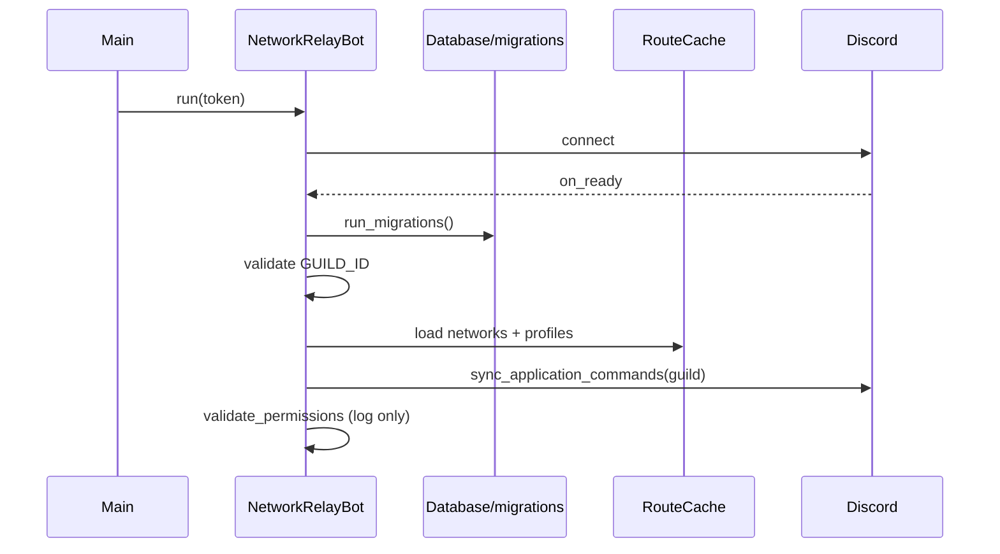
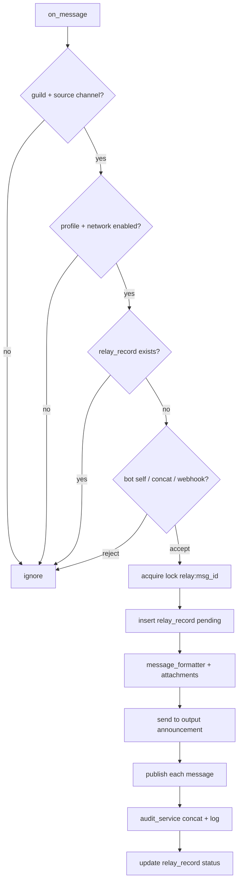
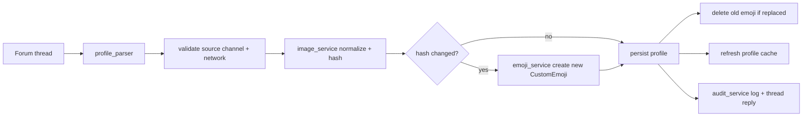

# The Network — Architecture

## Document Status

| Field | Value |
|-------|-------|
| **Product** | The Network (*Discord Announcement Network Relay*) |
| **Status** | Architecture — implementation blueprint |
| **MVP boundary** | Phases 1–8 per `doc/plan.md` §22 |
| **Sources** | `doc/design-spec.md`, `doc/plan.md` §4/§6/§7/§8/§9, `doc/wireframes.md` |
| **Output scope** | Python discord.py bot in single central guild; SQLite persistence |

This document describes **how** the bot is structured: package layout, domain models, persistence, service boundaries, Discord event wiring, and data flows. It does not re-specify product requirements; see `doc/design-spec.md` for REQs and acceptance criteria.

### Coordinator template artifacts — not applicable

The coordinator architecture template references game-engine concepts that have **no v1 counterpart** in this project:

| Template section | v1 status |
|------------------|-----------|
| Typed document data models | **N/A** — use frozen dataclasses / Pydantic in `bot/domain/` |
| Application sheet UI classes | **N/A** — use discord.py cogs + slash commands |
| Pack manifest document types | **N/A** — use SQLite DDL + repositories |
| Combat / Combatant | **N/A** — relay pipeline in `services/relay_service.py` |
| RegionBehavior | **N/A** — concat channel is audit mirror only |
| Token HUD | **N/A** — embed builders in cogs per `doc/wireframes.md` |
| Power budget (game stats) | **N/A** — operational limits in `utils/text_splitter.py`, `utils/retry.py`, `services/emoji_service.py` |

---

## Architectural Principles

These ten decisions from `doc/design-spec.md` Core Mechanics govern all modules:

1. **Source channel ID is authoritative server identity** — routing and profiles key on `source_channel_id`, not webhook author names.
2. **Forum profiles are configuration records** — forum threads hold YAML-like key-value config, not free-form discussion.
3. **Network routing is based on feed category** — each `Network` binds one feed category to one output announcement channel.
4. **Concat is an audit mirror, not a second relay hop** — plain-text mirror to `#concat`; never re-processed by `on_message`.
5. **Messages are recreated, not forwarded** — outbound `RelayedMessage` instances are new Discord messages with transformed headers.
6. **New messages are published from the output announcement channel** — crosspost/publish enables downstream Channel Follow.
7. **Emoji replacement is transactional** — create new `CustomEmoji` → persist profile → delete old emoji.
8. **Source message ID provides idempotency** — unique `relay_records.source_message_id` + per-message `asyncio.Lock`.
9. **SQLite is the initial source of truth** — networks, profiles, relay records, settings; no external DB in v1.
10. **Discord IDs are stored as integers** — never inferred from channel or role names.

Additional runtime constraints:

- Single process, single central guild (`GUILD_ID`).
- Cogs are thin; Discord I/O and orchestration live in injectable services.
- Pure logic (parser, formatter, splitter, routing resolution) is testable without discord.py.

---

## Package Layout

Full `bot/` tree from `doc/plan.md` §4, with module responsibilities and key public APIs.

```text
discord-network-relay/
├── bot/
│   ├── __init__.py
│   ├── main.py                 # Entrypoint: asyncio.run(main())
│   ├── config.py               # pydantic-settings: Settings (env bootstrap)
│   ├── client.py               # NetworkRelayBot, BotContext, setup_hook()
│   ├── constants.py            # RelayStatus enum, DEGRADED_FALLBACK = "◈"
│   │
│   ├── cogs/
│   │   ├── __init__.py
│   │   ├── admin.py            # /network, /maintenance, /status
│   │   ├── profiles.py         # /profile *, forum event listeners
│   │   ├── relay.py            # /relay *, on_message feed listener
│   │   └── _checks.py          # is_admin(): Manage Guild + moderator role gate
│   │
│   ├── db/
│   │   ├── __init__.py
│   │   ├── connection.py       # Database wrapper, connect()
│   │   ├── migrations.py       # run_migrations(), schema_version table
│   │   ├── models.py           # Row models: NetworkRow, ProfileRow, …
│   │   └── repositories.py     # *Repository CRUD + queries
│   │
│   ├── domain/
│   │   ├── __init__.py
│   │   ├── network.py          # Network frozen dataclass
│   │   ├── profile.py          # ServerProfile frozen dataclass
│   │   ├── relay_record.py     # RelayRecord, RelayResult
│   │   └── errors.py           # RelayError, ProfileParseError, …
│   │
│   ├── services/
│   │   ├── __init__.py
│   │   ├── profile_parser.py   # parse_profile(body, thread) -> ParsedProfile
│   │   ├── profile_sync.py     # sync_profile(thread) -> SyncResult
│   │   ├── emoji_service.py    # ensure_emoji(profile, image) -> EmojiResult
│   │   ├── image_service.py    # normalize_image(bytes) -> NormalizedImage
│   │   ├── routing_service.py    # resolve_route(channel_id) -> NetworkRoute | None
│   │   ├── relay_service.py    # relay_message(message) -> RelayResult
│   │   ├── message_formatter.py# build_relay_content(...) — pure
│   │   ├── attachment_service.py# prepare_attachments(...) 
│   │   └── audit_service.py    # log_relay(...), mirror_concat(...)
│   │
│   └── utils/
│       ├── __init__.py
│       ├── hashing.py          # sha256_bytes()
│       ├── discord_ids.py      # parse_channel_id(), mention helpers
│       ├── text_splitter.py    # split_content(...) -> ContinuationMessage chunks
│       └── retry.py            # retry_transient(coro, max=3)
│
├── tests/
│   ├── test_profile_parser.py
│   ├── test_message_formatter.py
│   ├── test_text_splitter.py
│   ├── test_routing_service.py
│   └── test_emoji_service.py
│
├── data/
│   └── .gitkeep
│
├── .env.example
├── pyproject.toml
├── Dockerfile
└── README.md
```

### Module responsibility matrix

| Path | Layer | Responsibility |
|------|-------|----------------|
| `main.py` | Bootstrap | Load settings, construct `NetworkRelayBot`, run event loop |
| `config.py` | Bootstrap | `Settings` from env: token, guild, DB path, feature flags |
| `client.py` | Discord + DI | Cog loading, `BotContext` construction, startup sequence |
| `constants.py` | Domain constants | `RelayStatus`, fallback emoji symbol |
| `cogs/*` | Presentation | Slash commands, event dispatch, embed builders |
| `db/*` | Persistence | aiosqlite connection, migrations, row mapping, repositories |
| `domain/*` | Domain | Immutable types, no discord.py imports |
| `services/*` | Application | Orchestration, Discord API calls via injected dependencies |
| `utils/*` | Pure helpers | Hashing, splitting, retry — no DB or Discord |

---

## Domain Models

Domain types live in `bot/domain/`. All persisted actors use frozen dataclasses (or Pydantic with frozen config). Ephemeral item types are DTOs used during relay/sync pipelines.

### Bot (Relay Client)

The **Bot (Relay Client)** is the runtime process — not a domain class. It is implemented by:

- `bot/main.py` — process entrypoint
- `bot/client.py` — `NetworkRelayBot(commands.Bot)` subclass
- `bot/config.py` — `Settings` for env bootstrap (`DISCORD_TOKEN`, `GUILD_ID`, etc.)

Responsibilities at startup (REQ-ACT-001 through REQ-ACT-004):

- Connect to Discord, initialize SQLite, run migrations
- Validate configured guild
- Load `Network` and `ServerProfile` caches
- Sync guild-scoped application commands
- Ignore self-authored messages in relay filter chain

```python
# bot/client.py (conceptual)
class NetworkRelayBot(commands.Bot):
    context: BotContext

    async def setup_hook(self) -> None:
        self.context = await build_bot_context(self, self.settings)
        await self.context.db.run_migrations()
        await self.context.routing_service.load_cache()
        await self.context.profile_sync.load_profile_cache()
        await self.tree.sync(guild=discord.Object(id=self.settings.guild_id))
```

### Network

Persistent actor grouping feed category, output announcement channel, optional concat channel, and enabled state.

```python
@dataclass(frozen=True)
class Network:
    id: int
    key: str
    display_name: str
    feed_category_id: int
    output_channel_id: int
    concat_channel_id: int | None
    enabled: bool
```

| Field | Type | Notes |
|-------|------|-------|
| `id` | `int` | SQLite PK |
| `key` | `str` | Unique slug, e.g. `stingers` |
| `display_name` | `str` | Human label for admin UI |
| `feed_category_id` | `int` | Category containing source + concat channels |
| `output_channel_id` | `int` | Destination announcement channel |
| `concat_channel_id` | `int \| None` | Optional audit mirror text channel |
| `enabled` | `bool` | Disabled networks ignore source messages |

**Owner:** `NetworkRepository`, `routing_service`, `cogs/admin.py` (`/network *`).

### ServerProfile

Maps one participating server to one source feed channel via a forum thread configuration record.

```python
@dataclass(frozen=True)
class ServerProfile:
    id: int
    profile_thread_id: int
    source_channel_id: int
    network_id: int
    server_name: str
    display_name: str
    enabled: bool
    emoji_id: int | None
    emoji_name: str | None
    image_hash: str | None
    degraded_reason: str | None
```

| Field | Type | Notes |
|-------|------|-------|
| `profile_thread_id` | `int` | Forum thread holding config |
| `source_channel_id` | `int` | **Authoritative server identity** |
| `network_id` | `int` | FK to `networks.id` |
| `emoji_id`, `emoji_name` | `int \| None`, `str \| None` | Guild `CustomEmoji` for relay header |
| `image_hash` | `str \| None` | SHA-256 of normalized `ProfileImage` |
| `degraded_reason` | `str \| None` | Set when emoji creation fails (guild cap) |

**Owner:** `ProfileRepository`, `profile_parser`, `profile_sync`, `emoji_service`, `cogs/profiles.py`.

### RelayRecord and RelayResult

**RelayRecord** tracks lifecycle for one source Discord message.

```python
@dataclass(frozen=True)
class RelayRecord:
    id: int
    source_message_id: int
    source_channel_id: int
    source_webhook_id: int | None
    profile_id: int
    network_id: int
    destination_channel_id: int
    destination_message_ids: tuple[int, ...]
    status: RelayStatus
    error_message: str | None
```

**RelayResult** is the service-layer outcome DTO (not persisted separately):

```python
@dataclass(frozen=True)
class RelayResult:
    source_message_id: int
    destination_message_ids: tuple[int, ...]
    published_message_ids: tuple[int, ...]
    success: bool
    error: str | None
```

**RelayStatus** (`bot/constants.py`):

```text
pending → sent → published
         ↘ failed_send | failed_publish | partial
```

**Owner:** `RelayRecordRepository`, `relay_service`, `cogs/relay.py`.

### Settings

**Settings** actor maps to the `settings` SQLite key-value table for bot-wide config not stored in environment variables. Optional domain wrapper:

```python
@dataclass(frozen=True)
class Setting:
    key: str
    value: str
    updated_at: str
```

Env bootstrap (`bot/config.py` `Settings` class) handles secrets and bootstrap IDs; DB `settings` table holds runtime overrides (e.g. future moderator role ID — **TBD**, see Open Questions).

**Owner:** `SettingsRepository`.

### Human Roles

Human roles are **permission gates**, not domain classes:

| Role | Interaction | Architecture surface |
|------|-------------|---------------------|
| **Central Guild Administrator** | Installs bot, defines networks, maintains profile forum, diagnoses failures, retries relays | All `/network`, `/profile`, `/relay`, `/maintenance`, `/status` commands via `cogs/_checks.py` |
| **Participating Server Operator** | Configures Channel Follow into dedicated source channel; maintains forum profile thread | Forum thread YAML body + starter `ProfileImage`; no bot slash commands required |
| **Downstream Follower Community** | Passive recipients via Discord Channel Follow on output announcement channel | No bot interaction in v1; receives published crossposts only |

Gate implementation:

```python
# bot/cogs/_checks.py
async def is_admin(interaction: discord.Interaction) -> bool:
    """Manage Guild OR configured moderator role (moderator role source TBD)."""
```

Errors use ephemeral embed per `doc/wireframes.md` Admin Permission Denied wireframe.

### Inbound/outbound item DTOs

#### FollowedAnnouncementMessage

Ephemeral inbound DTO wrapping `discord.Message` in a configured source channel. Identified by `source_message_id` + `source_channel_id`. Typically webhook-delivered (`webhook_id` non-null) unless `MANUAL_RELAY_ENABLED=true`.

```python
@dataclass(frozen=True)
class FollowedAnnouncementMessage:
    source_message_id: int
    source_channel_id: int
    webhook_id: int | None
    author_name: str          # webhook author for header
    content: str
    attachments: tuple[discord.Attachment, ...]
    embeds: tuple[discord.Embed, ...]
    # stickers, polls — extracted in relay_service
```

**Not persisted.** Constructed in `RelayCog.on_message` → `relay_service.relay_message`.

#### RelayedMessage

Outbound recreated message sent to output announcement channel.

```python
@dataclass(frozen=True)
class RelayedMessage:
    content: str              # header + body, AllowedMentions.none() at send
    files: tuple[discord.File, ...]
    embeds: tuple[discord.Embed, ...]
    destination_channel_id: int
```

Header format: `**{sanitized_author}** <:{emoji_name}:{emoji_id}>` or `◈` fallback.

#### ContinuationMessage

Additional chunks when transformed content exceeds Discord length limit.

```python
@dataclass(frozen=True)
class ContinuationMessage:
    content: str              # prefixed with "↳ continued"
    sequence_index: int
    source_message_id: int    # links to parent relay record
```

All continuation Discord message IDs stored in `relay_records.destination_message_ids` JSON array. Each continuation is published individually.

#### ProfileImage

First valid image attachment on forum starter message.

```python
@dataclass(frozen=True)
class ProfileImage:
    source_url: str           # Discord CDN URL only (v1)
    raw_bytes: bytes          # in-memory during sync
    normalized_bytes: bytes   # 128×128 PNG after Pillow pipeline
    content_hash: str         # SHA-256 of normalized bytes
```

Pipeline: verify format → RGBA → center-crop square → resize 128×128 → PNG → hash. Reject SVG, undecodable, oversized downloads.

#### CustomEmoji

Guild emoji created from `ProfileImage`.

```python
@dataclass(frozen=True)
class CustomEmoji:
    emoji_id: int
    emoji_name: str           # pattern: net_<slug>_<short_channel_id>
    profile_id: int
```

Rendering uses emoji ID in messages, not name. On guild emoji cap: degrade to `◈`, set `ServerProfile.degraded_reason`.

#### NetworkRoute

Resolved routing context for a source channel — **in-memory cache**, not a SQLite table.

```python
@dataclass(frozen=True)
class NetworkRoute:
    source_channel_id: int
    profile: ServerProfile
    network: Network
    output_channel_id: int
    concat_channel_id: int | None
```

Built by `routing_service.resolve_route(channel_id)` from profile cache + network cache. Maps source channel → parent feed category's network output channel.

#### AuditLogEntry

Structured log event for relay and admin operations.

```python
@dataclass(frozen=True)
class AuditLogEntry:
    event: str
    source_message_id: int | None
    source_channel_id: int | None
    profile_id: int | None
    network_id: int | None
    destination_channel_id: int | None
    destination_message_ids: tuple[int, ...]
    status: str
    error_class: str | None
    duration_ms: int | None
    message: str              # human-readable summary
```

Emitted to structured JSON logger and `RELAY_LOG_CHANNEL_ID` via `audit_service`.

### Exception types

```python
# bot/domain/errors.py
class RelayError(Exception): ...
class ProfileParseError(Exception): ...
class EmojiSyncError(Exception): ...
class RoutingError(Exception): ...
class PermissionValidationError(Exception): ...
```

Transient Discord errors are retried via `utils/retry.py` (max 3). Permanent failures (permissions, invalid channel type, emoji cap) are not retried.

---

## Persistence Layer

### Schema (DDL)

Verbatim from `doc/plan.md` §6.1–6.4.

#### 6.1 `networks`

```sql
CREATE TABLE networks (
    id INTEGER PRIMARY KEY AUTOINCREMENT,
    guild_id INTEGER NOT NULL,
    key TEXT NOT NULL UNIQUE,
    display_name TEXT NOT NULL,
    feed_category_id INTEGER NOT NULL UNIQUE,
    output_channel_id INTEGER NOT NULL UNIQUE,
    concat_channel_id INTEGER,
    enabled INTEGER NOT NULL DEFAULT 1,
    created_at TEXT NOT NULL,
    updated_at TEXT NOT NULL
);
```

#### 6.2 `profiles`

```sql
CREATE TABLE profiles (
    id INTEGER PRIMARY KEY AUTOINCREMENT,
    guild_id INTEGER NOT NULL,
    profile_thread_id INTEGER NOT NULL UNIQUE,
    profile_starter_message_id INTEGER NOT NULL UNIQUE,
    source_channel_id INTEGER NOT NULL UNIQUE,
    network_id INTEGER NOT NULL,
    server_name TEXT NOT NULL,
    display_name TEXT NOT NULL,
    enabled INTEGER NOT NULL DEFAULT 1,
    emoji_id INTEGER,
    emoji_name TEXT,
    image_hash TEXT,
    image_source_url TEXT,
    degraded_reason TEXT,
    created_at TEXT NOT NULL,
    updated_at TEXT NOT NULL,
    FOREIGN KEY (network_id) REFERENCES networks(id)
);
```

#### 6.3 `relay_records`

```sql
CREATE TABLE relay_records (
    id INTEGER PRIMARY KEY AUTOINCREMENT,
    source_message_id INTEGER NOT NULL UNIQUE,
    source_channel_id INTEGER NOT NULL,
    source_webhook_id INTEGER,
    profile_id INTEGER NOT NULL,
    network_id INTEGER NOT NULL,
    destination_channel_id INTEGER NOT NULL,
    destination_message_ids TEXT NOT NULL,
    status TEXT NOT NULL,
    error_message TEXT,
    created_at TEXT NOT NULL,
    updated_at TEXT NOT NULL,
    FOREIGN KEY (profile_id) REFERENCES profiles(id),
    FOREIGN KEY (network_id) REFERENCES networks(id)
);
```

`destination_message_ids` stored as JSON array string, e.g. `"[111, 112, 113]"`.

#### 6.4 `settings`

```sql
CREATE TABLE settings (
    key TEXT PRIMARY KEY,
    value TEXT NOT NULL,
    updated_at TEXT NOT NULL
);
```

### Row models and repositories

`bot/db/models.py` maps SQLite rows ↔ domain types:

| Row model | Domain type | Notes |
|-----------|-------------|-------|
| `NetworkRow` | `Network` | `enabled` stored as INTEGER 0/1 |
| `ProfileRow` | `ServerProfile` | includes `profile_starter_message_id`, `image_source_url` |
| `RelayRecordRow` | `RelayRecord` | JSON deserialize `destination_message_ids` |
| `SettingRow` | `Setting` | key-value |

`bot/db/repositories.py` public API:

```python
class NetworkRepository:
    async def create(self, ...) -> Network: ...
    async def get_by_key(self, key: str) -> Network | None: ...
    async def get_by_feed_category(self, category_id: int) -> Network | None: ...
    async def list_all(self) -> list[Network]: ...
    async def update(self, network: Network) -> Network: ...
    async def delete(self, key: str) -> None: ...
    async def set_enabled(self, key: str, enabled: bool) -> Network: ...

class ProfileRepository:
    async def upsert(self, profile: ServerProfile, ...) -> ServerProfile: ...
    async def get_by_source_channel(self, channel_id: int) -> ServerProfile | None: ...
    async def get_by_thread(self, thread_id: int) -> ServerProfile | None: ...
    async def list_all(self) -> list[ServerProfile]: ...
    async def delete(self, profile_id: int) -> None: ...
    async def set_enabled(self, profile_id: int, enabled: bool) -> ServerProfile: ...

class RelayRecordRepository:
    async def exists(self, source_message_id: int) -> bool: ...
    async def create_pending(self, ...) -> RelayRecord: ...
    async def update_status(self, record_id: int, status: RelayStatus, ...) -> RelayRecord: ...
    async def get_by_source_message(self, source_message_id: int) -> RelayRecord | None: ...
    async def list_recent(self, limit: int = 20) -> list[RelayRecord]: ...

class SettingsRepository:
    async def get(self, key: str) -> str | None: ...
    async def set(self, key: str, value: str) -> None: ...
```

**Layer rule:** only repositories execute SQL. Cogs never import `aiosqlite` directly.

### Migrations

`bot/db/migrations.py`:

```python
SCHEMA_VERSION = 1

MIGRATIONS: dict[int, list[str]] = {
    1: [
        "CREATE TABLE IF NOT EXISTS schema_version (...)",
        "CREATE TABLE networks (...)",
        "CREATE TABLE profiles (...)",
        "CREATE TABLE relay_records (...)",
        "CREATE TABLE settings (...)",
    ],
}

async def run_migrations(db: Database) -> int:
    """Apply pending migrations; return final version."""
```

Applied in `NetworkRelayBot.setup_hook()` before cache load. Idempotent `CREATE TABLE IF NOT EXISTS` for v1; future versions add numbered ALTER blocks.

---

## In-Memory Caches

| Cache | Key | Value | Invalidation |
|-------|-----|-------|--------------|
| Profile cache | `source_channel_id` | `ServerProfile` | Profile sync, enable/disable, delete; `/maintenance rebuild-cache` |
| Network by category | `feed_category_id` | `Network` | Network CRUD; rebuild-cache |
| Route resolution | `source_channel_id` | `NetworkRoute` | Derived from above two caches |
| Relay locks | `source_message_id` | `asyncio.Lock` | In-process only; released after relay completes |

`routing_service.load_cache()` and `profile_sync.load_profile_cache()` populate caches at startup (REQ-ACT-002). `/maintenance rebuild-cache` reloads from SQLite without emoji rebuild.

---

## Dependency Injection and Service Boundaries

### BotContext / ServiceContainer

All services and repositories are constructed once in `setup_hook()` and stored on the bot instance.

```python
@dataclass
class BotContext:
    settings: Settings
    db: Database
    network_repo: NetworkRepository
    profile_repo: ProfileRepository
    relay_record_repo: RelayRecordRepository
    settings_repo: SettingsRepository
    routing_service: RoutingService
    profile_parser: ProfileParser
    profile_sync: ProfileSyncService
    emoji_service: EmojiService
    image_service: ImageService
    relay_service: RelayService
    message_formatter: MessageFormatter
    attachment_service: AttachmentService
    audit_service: AuditService
    relay_locks: dict[int, asyncio.Lock]  # relay:<source_message_id>
```

Cogs access services via `self.bot.context.relay_service`, etc.

### Layer dependency

```text
discord.py events / app_commands
        ↓
    cogs/ (thin: parse interaction, call service, build embed)
        ↓
    services/ (orchestration, Discord API via injected bot/guild)
        ↓
    repositories/ + domain/ (SQLite, pure types)
        ↓
    utils/ (pure helpers)
```

### Layer rules

| Rule | Enforcement |
|------|-------------|
| Cogs do not execute SQL | Repositories only |
| Domain has no discord.py | DTOs may reference discord types only in service-layer adapters |
| Pure functions stay pure | `message_formatter`, `text_splitter`, `profile_parser` — no side effects |
| Discord guild/channel passed as params | Services take `guild: discord.Guild` or `bot: commands.Bot` per call, not globals |
| Single relay lock per source message | `relay_service` acquires `context.relay_locks[source_message_id]` |

### Service boundary summary

| Service | Inputs | Outputs | Discord API |
|---------|--------|---------|-------------|
| `routing_service` | `source_channel_id` | `NetworkRoute \| None` | None (cache only) |
| `profile_parser` | thread body text | `ParsedProfile` | None |
| `profile_sync` | forum thread | `SyncResult` | fetch messages, thread reply |
| `image_service` | attachment bytes | `ProfileImage` | download attachment |
| `emoji_service` | profile + image | `CustomEmoji` | create/delete emoji |
| `message_formatter` | author, profile, content | `str` | None |
| `attachment_service` | source attachments | `list[discord.File]` | download |
| `relay_service` | `FollowedAnnouncementMessage` | `RelayResult` | send, publish |
| `audit_service` | `AuditLogEntry` | None | log channel, concat mirror |

---

## Discord Client and Startup

### Entry flow

```text
main.py
  → load Settings from env (validate DISCORD_TOKEN, GUILD_ID)
  → NetworkRelayBot(settings)
  → bot.run(token)
  → setup_hook() [before on_ready completes command sync]
  → on_ready() [log startup status]
```

### Startup sequence diagram



Steps (plan §8.1):

1. Connect to Discord
2. Initialize database connection pool/wrapper
3. Run migrations
4. Validate configured guild exists and bot is member
5. Load networks and profiles into caches (**no** automatic full emoji rebuild)
6. Sync application commands to central guild
7. Validate channel permissions (log warnings; `/maintenance permissions` for detail)
8. Log startup status

---

## Event Handlers

### on_message (feed relay)

Registered in `cogs/relay.py` (`RelayCog`).

```python
@commands.Cog.listener()
async def on_message(self, message: discord.Message) -> None:
    if not self._is_potential_feed_message(message):
        return
    await self.bot.context.relay_service.relay_message(message)
```

Handler → service call graph:

```text
RelayCog.on_message
  → routing_service.resolve_route(message.channel.id)
  → relay_record_repo.exists(message.id)
  → relay_service.relay_message(message)
       → filter chain (13 steps)
       → message_formatter.build_relay_content
       → attachment_service.prepare_attachments
       → text_splitter.split_content (if needed)
       → channel.send(AllowedMentions.none())
       → message.publish() for each RelayedMessage + ContinuationMessage
       → audit_service.mirror_concat + log_relay
       → relay_record_repo.update_status
```

Per-message lock: `async with context.relay_locks.setdefault(msg_id, asyncio.Lock()):`.

### Forum profile events

Registered in `cogs/profiles.py` (`ProfileCog`):

| Event | Trigger | Service call |
|-------|---------|--------------|
| `on_thread_create` | New forum thread in profile forum | `profile_sync.sync_profile(thread)` |
| `on_thread_update` | Thread title change | `profile_sync.sync_profile(thread)` |
| `on_message` | Starter message in profile forum thread | `profile_sync.sync_profile(thread)` |
| `on_message_edit` | Starter body or attachment edit | `profile_sync.sync_profile(thread)` |
| `on_raw_message_delete` | Starter deleted | log; do not corrupt stored profile |
| `on_raw_thread_delete` | Thread deleted | log; profile retention policy per REQ-ADV-006 |

`/profile sync` is the **authoritative recovery** when Discord event delivery is inconsistent.

### Source edit/delete (v1 log-only)

| Event | v1 behavior |
|-------|-------------|
| Source message edited after relay | Log via `audit_service`; **do not** edit published relay messages |
| Source message deleted | Log deletion; retain `RelayRecord`; **do not** delete published announcements |

Deferred: `/relay refresh <message_link>` (post-MVP).

---

## Relay Pipeline

The relay pipeline is the functional equivalent of the design-spec "Combat System" section — end-to-end message processing from inbound `FollowedAnnouncementMessage` through publish and audit persistence.

### Filter chain (13 steps)

Processing order for each `on_message` in a feed source channel (plan §8.2, design-spec Combat System):

```text
 1. Is the message in the configured guild?
 2. Is the message in a configured source channel?
 3. Is the profile enabled?
 4. Is the network enabled?
 5. Is the message already present in relay_records?
 6. Is the message from the relay bot?
 7. Is the message in the concat channel? → ignore (audit mirror only)
 8. Is it a webhook message (or MANUAL_RELAY_ENABLED)?
 9. Acquire lock relay:<source_message_id>
10. Insert relay_record (pending)
11. Transform → RelayedMessage (+ ContinuationMessages if needed)
12. Send to output announcement channel
13. Publish each message; mirror concat; update relay_record status
```

Implemented primarily in `relay_service.relay_message()` with early returns at each filter step.

### Relay pipeline flowchart



### Transformation

`relay_service` orchestrates:

1. `message_formatter.build_relay_content(author_name, profile, content)` — header + body
2. `attachment_service.prepare_attachments(message.attachments)` — download, size limits
3. Embed copy (up to Discord limit) with plain-text fallback on failure
4. Stickers/polls → plain-text append
5. No interactive components
6. Reply reference — **TBD** (post-MVP default: omit)

### Send, publish, concat mirror

```python
# relay_service (conceptual send path)
sent = await output_channel.send(
    content=relayed.content,
    files=relayed.files,
    embeds=relayed.embeds,
    allowed_mentions=discord.AllowedMentions.none(),
)
await retry_transient(sent.publish, max=3)
```

Concat mirror (`audit_service.mirror_concat`):

- Writes plain-text copy of what was sent to output channel
- **Does not** trigger `on_message` relay processing
- Concat channel messages are rejected in filter step 7

### State machine

```text
                    ┌─────────┐
                    │ pending │
                    └────┬────┘
                         │ send OK
                    ┌────▼────┐
                    │  sent   │
                    └────┬────┘
                         │ publish OK (all chunks)
                    ┌────▼────────┐
                    │  published  │
                    └─────────────┘

Failure branches:
  pending → failed_send     (send error)
  sent    → failed_publish  (publish error after send)
  sent    → partial         (some continuations published, others not)
```

`/relay retry` reattempts from last failure state without duplicate publishes (REQ-ADV-011).

---

## Profile Sync and Emoji Lifecycle

### Profile sync flowchart



### Sync steps (`profile_sync.sync_profile`)

1. Fetch forum starter message
2. `profile_parser.parse_profile(body, thread)` — YAML-like keys, case-insensitive
3. Validate source channel in central guild; resolve `Network` by key or category inference
4. Extract first valid attachment → `ProfileImage` via `image_service`
5. Compare `image_hash` to stored profile
6. If hash changed: `emoji_service.ensure_emoji` — **create new before persist**
7. `profile_repo.upsert` — save `ServerProfile` with new emoji IDs
8. Delete old `CustomEmoji` only after successful create + persist (REQ-ADV-004)
9. Refresh profile cache; emit `AuditLogEntry`; reply in thread (success/warning/error)

Parse failure: do **not** overwrite previously valid profile; concise thread reply + full error to relay log.

### Emoji naming

```text
net_<slug>_<short_channel_id>
```

Example: `net_vanguard_345678`. Slug derived from `server_name` or `display_name`.

---

## Cogs and Slash Commands

All admin commands require `Manage Guild` or configured moderator role (`cogs/_checks.py`). Response policy: success embeds public; validation errors ephemeral (per wireframes).

### Command → service → embed mapping

#### admin.py — `/network`, `/maintenance`, `/status`

| Command | Service method(s) | Embed wireframe |
|---------|-------------------|-----------------|
| `/network create` | `NetworkRepository.create`, `routing_service.load_cache` | Network Create Success / Validation Error |
| `/network edit` | `NetworkRepository.update`, cache refresh | Network Edit |
| `/network list` | `NetworkRepository.list_all` | Network List |
| `/network disable` / `enable` | `NetworkRepository.set_enabled` | Network Enable/Disable |
| `/network validate` | routing + permission checks | Network Validate |
| `/network delete` | `NetworkRepository.delete`, cache refresh | Network Delete Confirm |
| `/maintenance validate` | cross-service consistency checks | Maintenance Validate |
| `/maintenance cleanup-emojis` | `emoji_service.cleanup_unused` (**criteria TBD**) | Maintenance Cleanup Emojis |
| `/maintenance rebuild-cache` | `routing_service.load_cache`, `profile_sync.load_profile_cache` | Maintenance Rebuild Cache |
| `/maintenance permissions` | permission audit across surfaces | Maintenance Permissions |
| `/status` | DB ping, cache counts, latency | Bot Status |

#### profiles.py — `/profile *`

| Command | Service method(s) | Embed wireframe |
|---------|-------------------|-----------------|
| `/profile sync` | `profile_sync.sync_profile` | Profile Sync Success / Error |
| `/profile sync-all` | enumerate forum threads → sync each | Profile Sync All Summary |
| `/profile show` | `ProfileRepository.get_by_thread` | Profile Show |
| `/profile disable` / `enable` | `ProfileRepository.set_enabled` | Profile Enable/Disable |
| `/profile repair-emoji` | `emoji_service.repair_emoji` | Profile Repair Emoji |
| `/profile delete` | `ProfileRepository.delete` (emoji retained) | Profile Delete |

Forum event listeners in same cog call `profile_sync.sync_profile`.

#### relay.py — `/relay *`, feed listener

| Command | Service method(s) | Embed wireframe |
|---------|-------------------|-----------------|
| `/relay test` | `message_formatter`, optional send (no publish unless flag) | Relay Test Preview |
| `/relay retry` | `relay_service.retry_relay` | Relay Retry Result |
| `/relay status` | `RelayRecordRepository.get_by_source_message` | Relay Status |
| `/relay recent` | `RelayRecordRepository.list_recent` | Relay Recent List |

### discord.py API surfaces

| Area | discord.py API | Used by |
|------|----------------|---------|
| Slash commands | `app_commands.Group`, `@app_commands.command`, guild sync | all cogs |
| Relay send | `channel.send(..., allowed_mentions=AllowedMentions.none())` | `relay_service` |
| Publish | `message.publish()` | `relay_service` |
| Forum threads | `on_thread_create`, `on_thread_update`, `Thread` | `profiles` cog |
| Raw deletes | `on_raw_message_delete`, `on_raw_thread_delete` | `profiles` cog |
| Emoji mgmt | `guild.create_custom_emoji`, `emoji.delete()` | `emoji_service` |
| Attachments | `attachment.read()`, `File(BytesIO)` | `attachment_service`, `image_service` |
| Embeds | `Embed` copy / rebuild | cogs + `relay_service` |
| Permissions | `channel.permissions_for(me)` | startup, `/maintenance permissions` |

---

## Power Budget Enforcement

Operational limits from design-spec Power Budget section:

| Limit | Module | Behavior |
|-------|--------|----------|
| Message length 2000 chars | `utils/text_splitter.py` | Split at paragraph/newline; `ContinuationMessage` with `↳ continued` prefix |
| Attachment download size + timeout | `attachment_service`, `image_service` | Skip oversized; audit warning |
| Embed count/field limits | `relay_service` | Copy up to Discord max; plain-text fallback |
| In-memory attachment buffers | `attachment_service` | No persistent disk storage of attachment bytes |
| Guild emoji cap | `emoji_service` | Degrade to `◈`; set `degraded_reason`; do not block relay |
| Transient API retry max 3 | `utils/retry.py` | Exponential backoff + jitter |
| No retry on permanent errors | `relay_service`, `emoji_service` | Permissions, invalid channel, emoji cap |
| Single guild, single process | architecture-wide | No job queue, no horizontal scaling |

`/maintenance cleanup-emojis`: administrative cleanup of unused emojis — **ownership criteria TBD** (open question).

---

## Logging and Audit

### Structured logging

Every relay completion/failure emits JSON-compatible dict:

```json
{
  "event": "relay_completed",
  "source_message_id": 123,
  "source_channel_id": 456,
  "profile_id": 7,
  "network_id": 2,
  "destination_channel_id": 789,
  "destination_message_ids": [111],
  "status": "published",
  "error_class": null,
  "duration_ms": 842
}
```

### Relay log channel

`audit_service.log_relay(AuditLogEntry)` posts concise human-readable messages to `RELAY_LOG_CHANNEL_ID` for:

- Relay completions and failures
- Profile sync results
- Degraded emoji states
- Source edit/delete notifications (v1 log-only)

---

## Security and Permissions

| Requirement | Implementation |
|-------------|----------------|
| Token in env only | `config.py`; never log `DISCORD_TOKEN` |
| Mention suppression | `AllowedMentions.none()` on all relay sends |
| Author name sanitization | `message_formatter.sanitize_author()` |
| Admin command restriction | `cogs/_checks.py` |
| Guild ID validation | startup + admin commands validate IDs against `GUILD_ID` |
| Attachment download limits | size cap + timeout in `attachment_service` |
| Profile image source | Discord-hosted attachments only; no arbitrary URLs |
| Public error messages | no stack traces in channels; full detail in logs |

### Permission validation surfaces

Startup and `/maintenance permissions` check bot permissions using **discord.py 2.x permission flag names** from the installed library version:

- Profile forum: View Channel, Read Message History, Send Messages in Threads
- Feed source: View Channel, Read Message History
- Concat: View Channel, Send Messages, Embed Links, Attach Files
- Output announcement: View Channel, Send Messages, Embed Links, Attach Files, Publish Messages
- Guild emoji: Create Expressions, Manage Expressions

---

## Testing Architecture

### Unit tests (no Discord)

| Test file | Module under test |
|-----------|-------------------|
| `test_profile_parser.py` | `profile_parser` — YAML keys, mentions, booleans, network inference |
| `test_message_formatter.py` | `message_formatter` — header, sanitization, fallback emoji |
| `test_text_splitter.py` | `text_splitter` — continuation splits, prefix |
| `test_routing_service.py` | `routing_service` — category mapping, disabled network |
| `test_emoji_service.py` | `emoji_service` — naming slug, create-before-delete order (mocked) |

### Integration tests (mocked discord.py)

- Valid webhook relay end-to-end through `relay_service`
- Manual message ignored when `MANUAL_RELAY_ENABLED=false`
- Disabled profile/network ignored
- Duplicate `source_message_id` ignored
- Publish failure → `failed_publish` status
- Profile image hash change → new emoji before old deletion

### Manual Discord test environment

Per plan §20.3: central test guild, external server with Channel Follow, feed category, source channel, profile forum, output announcement channel, downstream follower server.

---

## Mapping from design-spec

| Spec entity | Domain / DTO | SQLite | Service(s) | Entry point |
|-------------|--------------|--------|------------|-------------|
| **Bot (Relay Client)** | runtime | — | `client.py`, `main.py` | `on_ready`, cog load |
| **Network** | `Network` | `networks` | `routing_service`, `NetworkRepository` | `/network *` |
| **ServerProfile** | `ServerProfile` | `profiles` | `profile_parser`, `profile_sync`, `emoji_service` | forum events, `/profile *` |
| **RelayRecord** | `RelayRecord` | `relay_records` | `relay_service`, `RelayRecordRepository` | `on_message`, `/relay *` |
| **Settings** | `Setting` | `settings` | `SettingsRepository` | env + DB bootstrap |
| **Central Guild Administrator** | — | — | `cogs/_checks.py` | admin slash commands |
| **Participating Server Operator** | — | — | forum thread config | Channel Follow + profile thread |
| **Downstream Follower Community** | — | — | — | published crossposts only |
| **FollowedAnnouncementMessage** | inbound DTO | — | `relay_service` | `on_message` |
| **RelayedMessage** | outbound DTO | — | `message_formatter`, `relay_service` | send/publish |
| **ContinuationMessage** | split DTO | `destination_message_ids` JSON | `text_splitter`, `relay_service` | length overflow |
| **ProfileImage** | image DTO | `profiles.image_*` | `image_service` | `profile_sync` |
| **CustomEmoji** | emoji DTO | `profiles.emoji_*` | `emoji_service` | profile sync / repair |
| **NetworkRoute** | route DTO | — (cache) | `routing_service` | relay filter |
| **AuditLogEntry** | log DTO | — | `audit_service` | relay + sync |

---

## Open Questions (not resolved in architecture)

Carried from `doc/design-spec.md` — do **not** invent defaults:

1. **Moderator role** — env var vs `settings` table for `cogs/_checks.py` gate
2. **Manual relay flag** — operational policy for `MANUAL_RELAY_ENABLED`
3. **Reply reference** — optional quoted reply on relayed messages (post-MVP)
4. **Emoji cleanup criteria** — `/maintenance cleanup-emojis` "unused" definition
5. **Emoji budget guidance** — proactive cap warnings before deployment
6. **Product/network naming** — canonical slug for `net_<slug>_…` prefix
7. **Test Discord environment** — guild/token strategy for CI/manual validation

---

## Deferred / Not Applicable

| Feature | Status |
|---------|--------|
| Automatic source edit → relay edit sync | post-MVP (`/relay refresh`) |
| Automatic source delete → relay delete | post-MVP |
| Multiple central guilds | out of scope v1 |
| Web dashboard | out of scope v1 |
| External profile image URLs | out of scope v1 |
| Interactive component recreation | out of scope v1 |
| Per-message moderator approval | out of scope v1 |
| Cross-network fan-out from single source | out of scope v1 |
| Job queues / horizontal scaling | out of scope v1 |
| External database | out of scope v1 |
| Coordinator game-engine data/UI artifacts | **not applicable** |

---

## Related Documents

| Document | Purpose |
|----------|---------|
| [`doc/design-spec.md`](design-spec.md) | Actor/item types, REQs, relay pipeline semantics |
| [`doc/plan.md`](plan.md) | Schema, events, commands, phases, testing |
| [`doc/wireframes.md`](wireframes.md) | Embed field shapes for cog response builders |
| [`doc/intake-summary.md`](intake-summary.md) | Condensed requirements cross-check |

---

## Implementation Readiness Checklist

Phase 1 bootstrap agent can create `bot/main.py` + DB from this document:

- [x] Package tree defined with module purposes
- [x] SQLite DDL verbatim (4 tables + migrations pattern)
- [x] Domain models with field types
- [x] Repository interfaces
- [x] BotContext DI wiring
- [x] Event handler inventory
- [x] Relay filter chain (13 steps)
- [x] Profile sync + emoji lifecycle ordering
- [x] Slash command inventory
- [x] All design-spec actor and item types mapped
- [x] Data flow diagrams: startup, relay, profile sync, layer dependency
